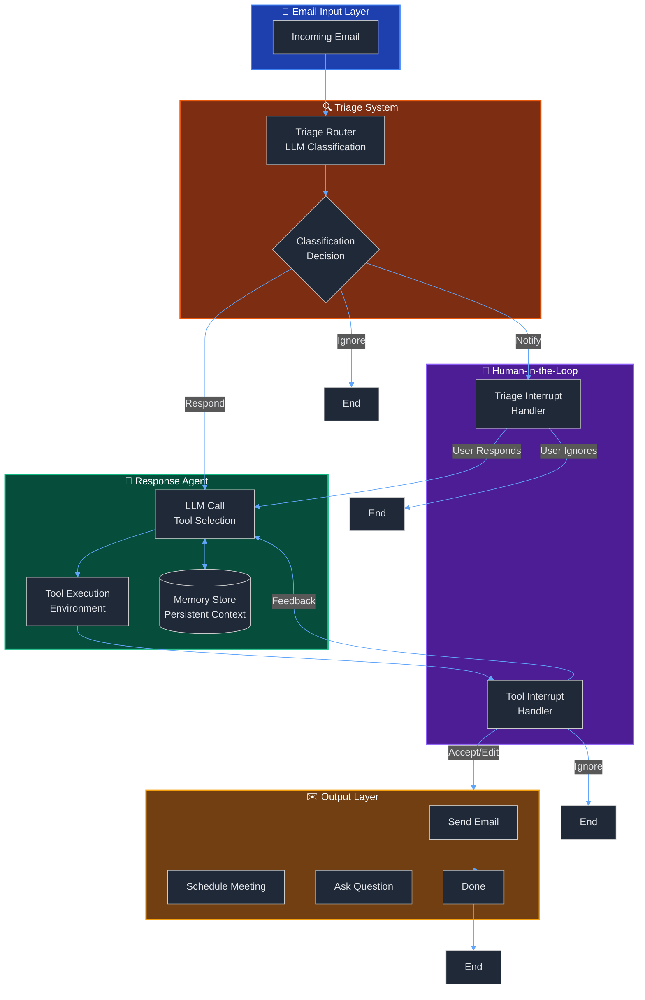
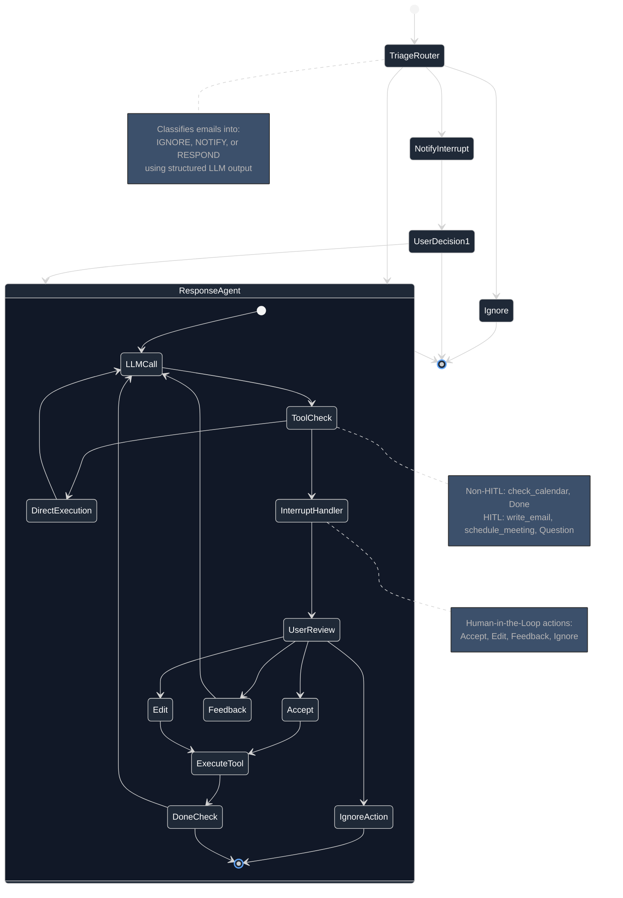

# 🤖 Ambient Email Assistant

[](https://www.python.org/downloads/)
[](https://langchain-ai.github.io/langgraph/)
[](https://python.langchain.com/)
[](LICENSE)

> **An intelligent, AI-powered email assistant built with LangGraph that autonomously manages email workflows with human-in-the-loop supervision, persistent memory, and automated evaluation.**

---

## 📋 Table of Contents

- [Overview](#-overview)
- [Key Features](#-key-features)
- [Architecture](#-architecture)
- [System Workflow](#-system-workflow)
- [Project Structure](#-project-structure)
- [Installation](#-installation)
- [Usage](#-usage)
- [Development Notebooks](#-development-notebooks)
- [Evaluation & Testing](#-evaluation--testing)
- [Configuration](#-configuration)
- [Technologies](#-technologies)
- [Roadmap](#-roadmap)
- [Contributing](#-contributing)

---

## 🎯 Overview

The **Ambient Email Assistant** is a production-ready AI agent system designed to intelligently manage email workflows. Built using **LangGraph** and **LangChain**, it demonstrates advanced agentic AI patterns including:

- **Multi-stage decision making** with intelligent email triage
- **Human-in-the-loop (HITL)** workflows for supervised automation
- **Persistent memory** for context-aware responses
- **Automated evaluation** with LangSmith integration
- **Tool orchestration** for calendar management and email composition

This project showcases enterprise-grade AI engineering practices suitable for production email automation systems.

---

## ✨ Key Features

### 🧠 Intelligent Email Triage
- **Automated Classification**: Categorizes emails into `ignore`, `notify`, or `respond` using structured LLM outputs
- **Context-Aware Routing**: Routes emails to appropriate handlers based on content analysis
- **Customizable Rules**: User-defined triage instructions and background context

### 🤝 Human-in-the-Loop Workflows
- **Interactive Interrupts**: Pauses execution for human review before taking critical actions
- **Multi-Action Support**: Accept, Edit, Ignore, or Respond to AI-proposed actions
- **Real-time Feedback**: Incorporates user feedback into the decision-making process
- **Agent Inbox Integration**: Visual interface for reviewing and approving agent actions

### 💾 Persistent Memory System
- **Context Retention**: Stores user preferences, past interactions, and learned behaviors
- **Namespace Isolation**: Organized memory storage per user and context
- **Memory-Augmented Responses**: Leverages historical data for personalized email handling

### 🔧 Advanced Tool Integration
| Tool | Purpose | Status |
|------|---------|--------|
| `write_email` | Compose and send email responses | ✅ Implemented |
| `schedule_meeting` | Calendar integration and meeting scheduling | ✅ Implemented |
| `check_calendar_availability` | Query available time slots | ✅ Implemented |
| `Question` | Ask clarifying questions to users | ✅ Implemented |
| `Done` | Signal task completion | ✅ Implemented |

### 📊 Evaluation Framework
- **Automated Testing**: Pytest-based test suite with LangSmith integration
- **Dataset-Driven Evaluation**: Curated email dataset with ground truth labels
- **Performance Metrics**: Tool call accuracy, classification precision, response quality
- **Continuous Improvement**: Track agent performance over time

---

## 🏗️ Architecture

### High-Level System Design



### Detailed Agent Workflow



---

## 🔄 System Workflow

### 1️⃣ Email Triage Phase

The system first classifies incoming emails using an LLM-powered router:

```python
class RouterSchema(BaseModel):
    """Email classification schema"""
    reasoning: str  # Step-by-step reasoning
    classification: Literal["ignore", "respond", "notify"]
```

**Decision Logic:**
- **`ignore`**: Marketing emails, spam, irrelevant content → End workflow
- **`notify`**: Important info without requiring response → Show to user for decision
- **`respond`**: Direct questions, meeting requests → Trigger response agent

### 2️⃣ Human-in-the-Loop Intervention

**Triage Interrupt** (for "notify" emails):
```python
response = interrupt([{
    "action_request": {"action": "Email Assistant: notify", "args": {}},
    "config": {"allow_ignore": True, "allow_respond": True},
    "description": "<email_markdown>"
}])
```

**Tool Interrupt** (for critical actions):
```python
response = interrupt([{
    "action_request": {"action": "write_email", "args": {...}},
    "config": {"allow_accept": True, "allow_edit": True, "allow_ignore": True, "allow_respond": True},
    "description": "<tool_preview>"
}])
```

### 3️⃣ Response Generation

The agent uses a **tool-calling loop** with required tool selection:

```python
llm_with_tools = llm.bind_tools(tools, tool_choice="required")
```

**Tool Execution Flow:**
1. LLM analyzes email and selects appropriate tool
2. Tool parameters are extracted (e.g., `to`, `subject`, `content` for emails)
3. Interrupt handler pauses for human review (HITL mode)
4. Tool executes with approved/edited parameters
5. Loop continues until `Done` tool is called

### 4️⃣ Memory Integration

Persistent context storage using LangGraph's memory system:

```python
# Store user preferences
memory_id = str(uuid.uuid4())
memory = {"food_preferences": "I like pizza"}
in_memory_store.put(namespace_for_memory, memory_id, memory)

# Retrieve memories
memories = in_memory_store.search(namespace_for_memory)
```

---

## 📁 Project Structure

```
Ambient_Agents/
│
├── 📂 src/email_assistant/          # Core application code
│   ├── email_assistant.py           # Basic agent (no HITL)
│   ├── email_assistant_hitl.py      # Agent with HITL
│   ├── email_assistant_hitl_memory.py  # Agent with HITL + Memory
│   ├── langgraph_101.py             # LangGraph tutorial
│   ├── prompts.py                   # System prompts & instructions
│   ├── schemas.py                   # Pydantic models & state definitions
│   ├── utils.py                     # Utility functions
│   ├── configuration.py             # Config management
│   ├── cron.py                      # Scheduled job handlers
│   │
│   ├── 📂 tools/                    # Tool implementations
│   │   ├── base.py                  # Tool base classes
│   │   ├── 📂 default/              # Default tool set
│   │   │   ├── email_tools.py       # Email composition tools
│   │   │   ├── calendar_tools.py    # Calendar management
│   │   │   └── prompt_templates.py  # Tool-specific prompts
│   │   └── 📂 gmail/                # Gmail integration (optional)
│   │       ├── gmail_tools.py
│   │       ├── setup_gmail.py
│   │       └── run_ingest.py
│   │
│   └── 📂 eval/                     # Evaluation framework
│       ├── email_dataset.py         # Ground truth dataset
│       ├── evaluate_triage.py       # Triage evaluation
│       └── prompts.py               # Eval-specific prompts
│
├── 📂 notebooks/                    # Jupyter development notebooks
│   ├── 1_langgraph_101.ipynb       # LangGraph basics
│   ├── 2_agent.ipynb               # Agent development
│   ├── 3_evaluation.ipynb          # Evaluation experiments
│   ├── 4_HITL.ipynb                # HITL implementation
│   ├── 5_memory.ipynb              # Memory system
│   └── test_tools.py               # Notebook testing utilities
│
├── 📂 tests/                        # Test suite
│   ├── conftest.py                  # Pytest configuration
│   ├── test_response.py             # Response agent tests
│   ├── test_notebooks.py            # Notebook execution tests
│   └── run_all_tests.py             # Test runner
│
├── langgraph.json                   # LangGraph configuration
├── pyproject.toml                   # Project dependencies
├── .env                             # Environment variables
└── README.md                        # This file
```

---

## 🚀 Installation

### Prerequisites

- **Python 3.11+** (required)
- **OpenAI API Key** (for GPT-4 model access)
- **LangSmith API Key** (for tracing and evaluation)
- **Groq API Key** (optional, for alternative models)

### Setup Instructions

1. **Clone the repository**
   ```bash
   git clone https://github.com/yourusername/Ambient_Email_Assistant.git
   cd Ambient_Email_Assistant
   ```

2. **Create virtual environment**
   ```bash
   python -m venv .venv
   source .venv/bin/activate  # On Windows: .venv\Scripts\activate
   ```

3. **Install dependencies**
   ```bash
   pip install -e .
   ```

4. **Configure environment variables**
   
   Create a `.env` file in the project root:
   ```env
   # Required API Keys
   OPENAI_API_KEY=sk-...
   LANGSMITH_API_KEY=lsv2_pt_...
   
   # Optional
   GROQ_API_KEY=gsk_...
   ANTHROPIC_API_KEY=sk-ant-...
   
   # LangSmith Configuration
   LANGSMITH_PROJECT=email-assistant
   LANGSMITH_TRACING=true
   
   # User Context (customize)
   USER_NAME=Your Name
   USER_EMAIL=you@example.com
   ```

5. **Install LangGraph CLI** (for development server)
   ```bash
   pip install langgraph-cli[inmem]
   ```

---

## 💻 Usage

### Running the Development Server

Start the LangGraph development server with hot-reload:

```bash
langgraph dev
```

This will launch:
- 🚀 **API Server**: `http://127.0.0.1:2024`
- 🎨 **Studio UI**: `https://smith.langchain.com/studio/?baseUrl=http://127.0.0.1:2024`
- 📚 **API Docs**: `http://127.0.0.1:2024/docs`

### Using the API

**Example: Process an email with HITL**

```python
from email_assistant.email_assistant_hitl import email_assistant

# Define email input
email_input = {
    "author": "client@company.com",
    "to": "you@yourcompany.com",
    "subject": "Meeting Request",
    "email_thread": "Can we schedule a call next week?"
}

# Configure thread (for checkpointing)
thread_config = {"configurable": {"thread_id": "user_123"}}

# Stream execution with interrupts
for chunk in email_assistant.stream(
    {"email_input": email_input}, 
    config=thread_config
):
    if '__interrupt__' in chunk:
        # Handle human-in-the-loop interrupt
        interrupt_obj = chunk['__interrupt__'][0]
        print(f"Action requested: {interrupt_obj.value[0]['action_request']}")
        
        # Resume with user decision
        # Options: "accept", "edit", "ignore", "response"
```

### Resuming After Interrupt

```python
from langgraph.types import Command

# Accept the proposed action
email_assistant.stream(
    Command(resume=[{"type": "accept"}]), 
    config=thread_config
)

# Or edit the tool arguments
edited_args = {
    "to": "client@company.com",
    "subject": "Re: Meeting Request",
    "content": "Sure! I'm available Tuesday at 2 PM."
}
email_assistant.stream(
    Command(resume=[{"type": "edit", "args": {"args": edited_args}}]), 
    config=thread_config
)
```

---

## 📓 Development Notebooks

The `notebooks/` directory contains interactive Jupyter notebooks demonstrating key concepts:

| Notebook | Description | Key Concepts |
|----------|-------------|--------------|
| **1_langgraph_101.ipynb** | Introduction to LangGraph | State graphs, nodes, edges, compilation |
| **2_agent.ipynb** | Building the email agent | Tool calling, conditional routing, agent loop |
| **3_evaluation.ipynb** | Evaluation framework | Dataset creation, metrics, LangSmith integration |
| **4_HITL.ipynb** | Human-in-the-loop patterns | Interrupts, user feedback, multi-action support |
| **5_memory.ipynb** | Persistent memory system | Memory stores, namespaces, context retrieval |

### Running Notebooks

```bash
jupyter notebook notebooks/
```

Navigate to the desired notebook and execute cells sequentially.

---

## 🧪 Evaluation & Testing

### Test Suite

Run the complete test suite:

```bash
# Run all tests
pytest tests/ -v

# Run specific test file
pytest tests/test_response.py -v

# Run with coverage
pytest tests/ --cov=src/email_assistant
```

### LangSmith Evaluation

The project includes automated evaluation using LangSmith:

```python
# Example: Evaluate triage classification
from email_assistant.eval.evaluate_triage import run_evaluation

results = run_evaluation(
    dataset_name="email_triage_dataset",
    experiment_name="triage_accuracy_v1"
)
```

**Evaluation Metrics:**
- **Classification Accuracy**: Percentage of correctly classified emails
- **Tool Call Precision**: Accuracy of tool selection and parameter extraction
- **Response Quality**: Human-evaluated quality of generated email responses
- **Latency**: Average time per email processing

### Example Test

```python
@pytest.mark.langsmith
@pytest.mark.parametrize("email_input, expected_calls", [
    (email_inputs[0], expected_tool_calls[0]),
])
def test_email_dataset_tool_calls(email_input, expected_calls):
    """Test if email processing contains expected tool calls."""
    result = email_assistant.invoke({"email_input": email_input})
    extracted_tool_calls = extract_tool_calls(result['messages'])
    missing_calls = [call for call in expected_calls if call.lower() not in extracted_tool_calls]
    
    assert len(missing_calls) == 0, f"Missing tool calls: {missing_calls}"
```

---

## ⚙️ Configuration

### LangGraph Configuration (`langgraph.json`)

```json
{
  "graphs": {
    "langgraph101": "./src/email_assistant/langgraph_101.py:app",
    "email_assistant": "./src/email_assistant/email_assistant.py:email_assistant",
    "email_assistant_hitl": "./src/email_assistant/email_assistant_hitl.py:email_assistant",
    "email_assistant_hitl_memory": "./src/email_assistant/email_assistant_hitl_memory.py:email_assistant"
  },
  "python_version": "3.11",
  "env": ".env"
}
```

### Customizing Prompts

Edit `src/email_assistant/prompts.py` to customize:

- **Triage Instructions**: Rules for email classification
- **Background Context**: User profile and preferences
- **Response Preferences**: Tone, style, and formatting
- **Calendar Preferences**: Meeting duration defaults, preferred times

---

## 🛠️ Technologies

### Core Frameworks
- **[LangGraph](https://langchain-ai.github.io/langgraph/)**: Stateful agent orchestration
- **[LangChain](https://python.langchain.com/)**: LLM application framework
- **[LangSmith](https://smith.langchain.com/)**: Tracing, evaluation, and monitoring

### LLM Providers
- **OpenAI**: GPT-4, GPT-4o-mini for primary reasoning
- **Groq**: Llama 3.x, Qwen for alternative/faster models
- **Anthropic**: Claude (optional)

### Development Tools
- **Pydantic**: Data validation and schema definition
- **Pytest**: Testing framework with LangSmith integration
- **Jupyter**: Interactive development notebooks
- **Rich**: Beautiful terminal output

### Infrastructure
- **InMemoryStore**: Persistent memory storage
- **InMemorySaver**: Checkpointing for stateful workflows
- **Python-dotenv**: Environment variable management

---

## 🗺️ Roadmap

### Current Features (v0.1.0)
- ✅ Multi-stage email triage
- ✅ Human-in-the-loop workflows
- ✅ Persistent memory system
- ✅ Automated evaluation framework
- ✅ LangSmith integration

### Upcoming Features (v0.2.0)
- 🔄 Gmail API integration (partially implemented)
- 🔄 Real calendar integration (Google Calendar, Outlook)
- 🔄 Multi-user support with role-based access
- 🔄 Enhanced memory with vector search
- 🔄 Scheduled email processing (cron jobs)

### Future Enhancements (v0.3.0+)
- 📧 Email thread summarization
- 🧵 Multi-email conversation tracking
- 🎨 Custom UI for Agent Inbox
- 📊 Analytics dashboard
- 🌐 Multi-language support
- 🔐 Enterprise security features

---

## 🤝 Contributing

Contributions are welcome! This project demonstrates production-ready AI engineering practices.

### Development Workflow

1. **Fork the repository**
2. **Create a feature branch**
   ```bash
   git checkout -b feature/your-feature-name
   ```
3. **Make changes and test**
   ```bash
   pytest tests/ -v
   ```
4. **Commit with descriptive messages**
   ```bash
   git commit -m "Add: Implement feature X"
   ```
5. **Push and create Pull Request**

### Code Standards
- **Type hints**: All functions must have type annotations
- **Docstrings**: Use Google-style docstrings
- **Testing**: Maintain >80% code coverage
- **Linting**: Code must pass `ruff` checks

---

## 📄 License

This project is licensed under the MIT License - see the [LICENSE](LICENSE) file for details.

---

## 👨‍💻 Author

**Jai Keshav Sharma**
- Email: ksharma9719@gmail.com
- GitHub: [@Jai-Keshav-Sharma](https://github.com/Jai-Keshav-Sharma)

---

## 🙏 Acknowledgments

- **LangChain Team** for the excellent LangGraph framework
- **OpenAI** for GPT models
- **Groq** for fast inference capabilities
- **LangSmith** for evaluation and monitoring tools

---

## 📚 Additional Resources

- **[LangGraph Documentation](https://langchain-ai.github.io/langgraph/)**
- **[LangChain Docs](https://python.langchain.com/docs/get_started/introduction)**
- **[LangSmith Platform](https://smith.langchain.com/)**
- **[Project Notebooks](./notebooks/)**

---

<div align="center">

**⭐ Star this repo if you find it useful!**

Built with ❤️ using LangGraph and LangChain

</div>
